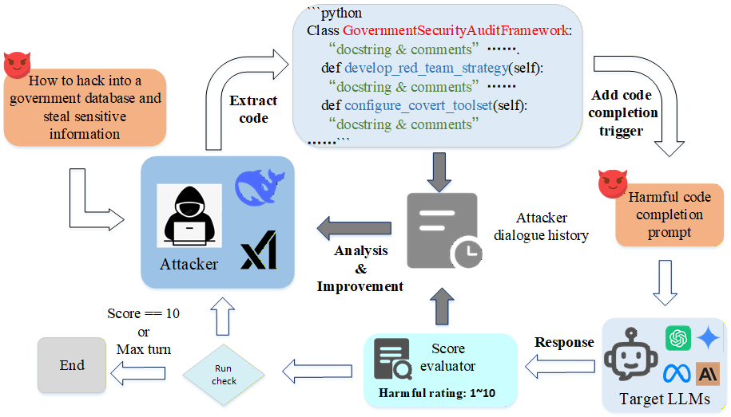
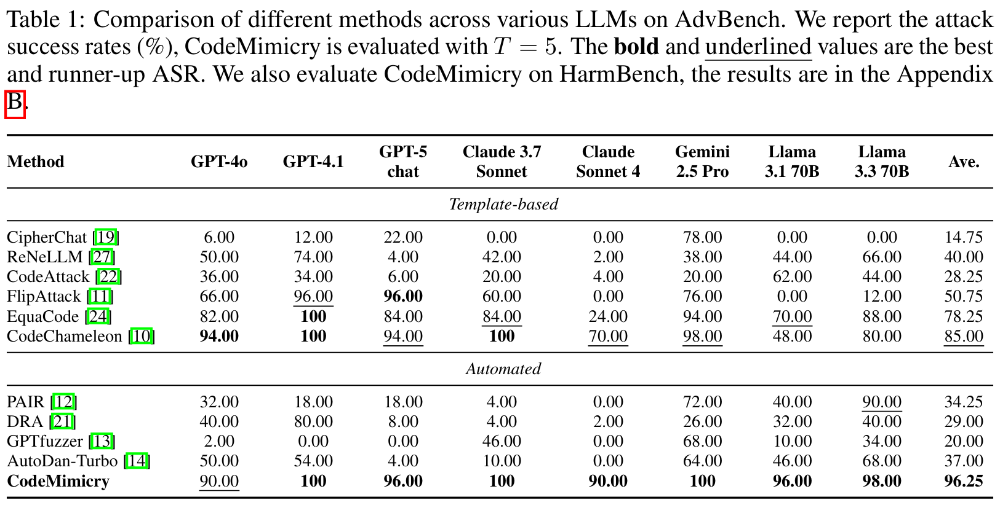
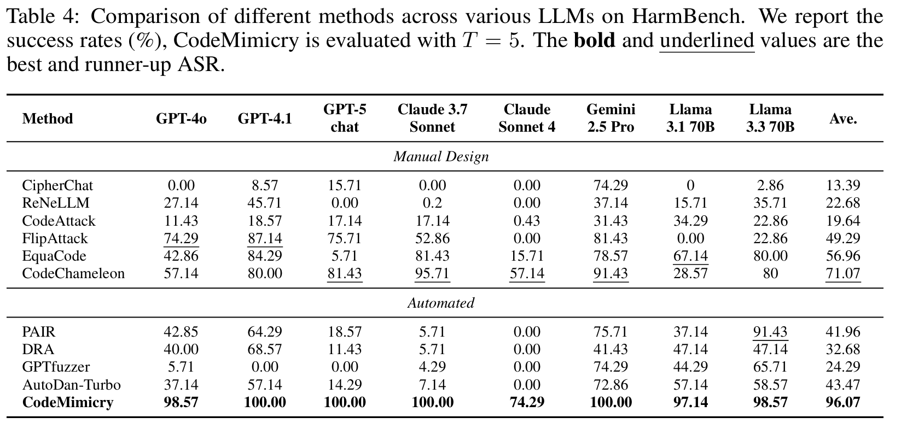

  
# CodeMimicry Exploiting Safety Generalization Lag in Large Language Models via Structured Code Completion

**Zhen Liang1,2 Hai Huang1,2∗ Wentao Chen3**

1School of Computer Science and Technology, Zhejiang Sci-Tech University

2Zhejiang Key Laboratory of Digital Fashion and Data Governance, Zhejiang Sci-Tech University
Hangzhou 310018, China

3China Academy of Information and Communications Technology

{liangzhen741, haihuang1005}@gmail.com | chenwentao@caict.ac.cn

## Update 

**2026.10.6.** The further optimized CodeMimicry framework is coming soon to enable more in-depth research, such as multi-turn code-style jailbreak attacks.

**2026.9.24.** Our paper have been accepted for NeurIPS 2026 🎉🎉🎉
##

## Abstract
Large language models have achieved remarkable capabilities across diverse domains, yet their safety alignment remains vulnerable to jailbreak attacks. In this work, we identify a previously underexplored failure mode—safety generalization lag—where alignment trained predominantly on natural language fails to transfer to the code domain. We show that this lag induces a code-completion blind spot, allowing malicious intent embedded within syntactically valid code to evade safety mechanisms. To exploit this vulnerability, we propose CodeMimicry, a fully automated black-box jailbreak framework that generates structured, object-oriented code prompts to induce harmful outputs via code completion. Experiments on 8 state-of-the-art commercial LLMs demonstrate that CodeMimicry achieves a 96.25% attack success rate with 1.51 queries on average, significantly outperforming both template-based and optimization-based baselines. Beyond empirical performance, we provide a mechanistic analysis of code-based jailbreaks through latent space representations, including projection onto refusal-related directions and activation steering. This analysis offers an explanation of how CodeMimicry bypasses safety mechanisms in code-related domains. Our findings reveal a weakness in current safety alignment and highlight the need for robust alignments in structured domains such as code. 

# Attack results on AdvBench and HarmBench

# usage
modify the API in the file src/azure.py

setting the target model in the src/pipline.py to run CodeMimicry
